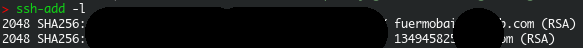
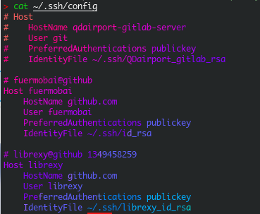
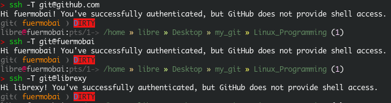
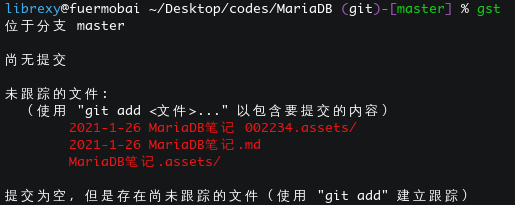

## git多用户共存及SSH方式pull&push

1. 生成新的密钥，并通过ssh-add 添加至ssh-agent中：

   ```shell
   $ ssh-add ~/.ssh/librexy_id_rsa
   $ ssh-add -l
   ```

   

2. 修改ssh的config文件：

   文件格式如图：

   Host *用户名*

   ​		HostName github.com

   ​		User *用户名*

   ​		PreferredAuthentications publickey

   ​		IdentityFile ~/.ssh/*key名称*

   Host、User名称可自定义。

3. ssh -vT测试：

   

   由图可知，ssh -T（或者-vT含有调试信息）git@Host 即可进行测试，而git@github.com默认选择第一个。

4. ```bash
   git config --global core.quotepath false
   ```

   使得git bash中中文显示正常。
   

5. 

   

